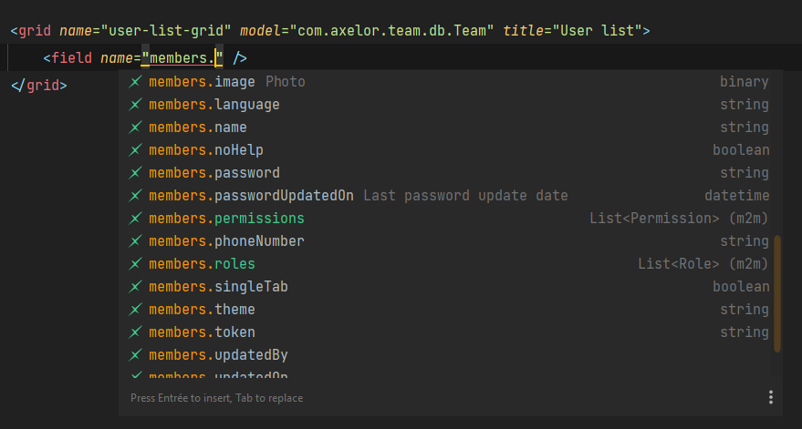
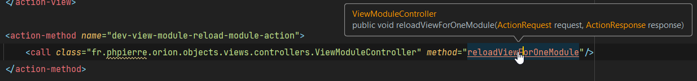
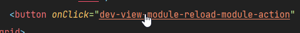
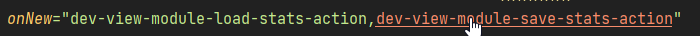
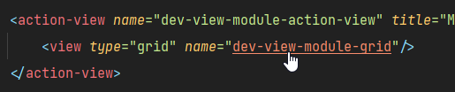
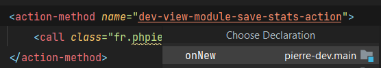

# IntelliJ IDEA - Axelor Plugin

## Description

<!-- Plugin description -->
This plugin improves your development with the Axelor Open Platform Framework. 
You can now <kbd>Ctrl</kbd> <kbd>Click️</kbd> everywhere in XML files.

## Features

- **NEW :** Views hot reload with [this Axelor module](https://github.com/PHPierrre/Axelor-IntelliJ-Views-Hot-Reload)
- Fields, relational fields, inherited fields auto-completion.
- Fields, relational fields, inherited fields navigation (Ctrl + click)
- Action navigation (onSave, onSelect, onLoad, onNew, onEdit, onDelete, onChange)
- Reverse view, action and selection navigation (from child to parent)
- Action method navigation to Java files.
- Automatic injected language HTML in CDATA
- Detection of wrongly configured IntelliJ Project.
- Model navigation and auto-completion.
- View navigation (Ctrl click), detection of unknown views.
- Selection navigation (Ctrl click) and auto-completion.
- Xml attributes auto-completion.
- application.properties display.
<!-- Plugin description end -->

## Usage

- Fields auto completion

- Action method navigation

- Action references shortcut to child

- View references shortcut to child

- Action references shortcut to parent

## Installation

- Using IDE built-in plugin system:
  
  <kbd>Settings/Preferences</kbd> > <kbd>Plugins</kbd> > <kbd>Marketplace</kbd> > <kbd>Search for "axelor-devtools"</kbd> >
  <kbd>Install Plugin</kbd>
  
- Manually:

  Download the [latest release](https://github.com/PHPierrre/axelor-devtools/releases/latest) and install it manually using
  <kbd>Settings/Preferences</kbd> > <kbd>Plugins</kbd> > <kbd>⚙️</kbd> > <kbd>Install plugin from disk...</kbd>

